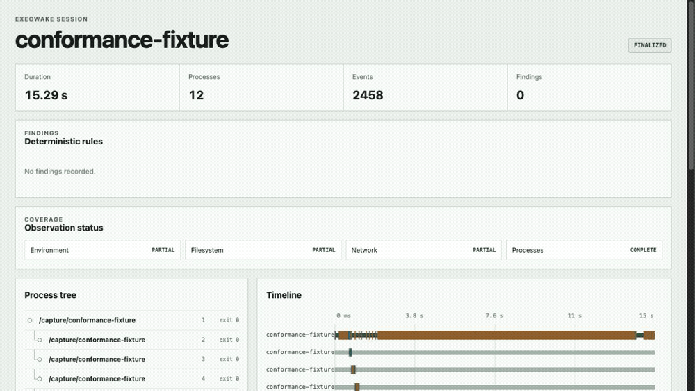
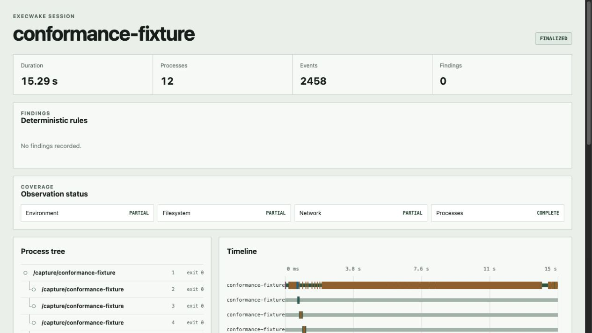

# ExecWake

[English](README.md)



ExecWake записывает наблюдаемые побочные эффекты команды и сравнивает поведение
между запусками.

Изображение выше получено при запуске Linux conformance fixture: 12 процессов,
2 458 событий, полное покрытие процессов и частичное покрытие файловой системы,
сети и окружения.

## Состояние проекта

ExecWake 0.1.0-rc.1 — альфа-версия для Linux. Сборщик записывает:

- fork, clone, exec и exit процессов, код завершения и завершающий сигнал;
- файловые операции и проверенные изменения итогового состояния;
- операции connect, bind, listen, send и receive для TCP и UDP через IPv4 и
  IPv6;
- DNS-имена, только когда записанный ответ позволяет с высокой уверенностью
  связать имя с адресом;
- имена унаследованных переменных окружения без их значений.

Покрытие процессов считается полным, если события не были потеряны. Покрытие
файловой системы, сети и окружения отмечается как частичное, поскольку
наблюдение за системными вызовами не доказывает, что записано всё поведение.
ExecWake показывает сокеты, а не HTTP-запросы, и не хранит произвольные данные
приложений.

Основной механизм сбора в Linux использует привязанный к cgroup eBPF-сборщик для
событий процессов, файловой системы и сокетов. Для него нужны cgroup v2,
tracepoint `sched` и `raw_syscalls` в tracefs, разрешение создавать дочернюю
cgroup и загружать eBPF-программы. Если эти требования не выполнены, ExecWake
переключается на ptrace. Выбранный backend сохраняется в манифесте каждой
сессии. Текущие замеры накладных расходов опубликованы в
[benchmarks/RESULTS.md](benchmarks/RESULTS.md).

## Сборка

Требуется Rust 1.67 или новее.

```sh
cargo build --locked --release
cargo test --all-targets
```

Собранные ресурсы отчёта хранятся в репозитории. Для изменения Svelte-приложения
используйте Node.js 22 и пересоберите ресурсы:

```sh
cd web
npm ci
npm run check
npm run build
```

## Запуск

Всё после `--` передаётся напрямую как argv. ExecWake не интерпретирует строку
как shell-команду.

```sh
execwake run -- npm install some-package
execwake run -- cargo test
```

Сохраняется поведение stdin, stdout, stderr, сигналов, определения терминала и
кода завершения дочернего процесса. В интерактивном графическом терминале
локальный отчёт открывается автоматически. В CI и headless-среде выводится путь
к SQLite-файлу сессии.

Для pipeline нужно явно запустить shell:

```sh
execwake run -- sh -c 'printf input | sort'
```

### Дополнительные данные Node

Сбор дополнительных данных Node по умолчанию выключен. Для Node-команды его
можно включить так:

```sh
execwake run --node-enrichment -- node app.js
```

В манифесте такой сессии используется режим `instrumented`, а покрытие
`node_enrichment` отмечается как частичное. Runtime-события содержат только:

- HTTP-метод и очищенные `host` и `path`;
- имя свойства, прочитанного через `process.env`;
- идентификатор процесса и монотонную отметку времени.

Строки запроса, фрагменты, значения окружения, заголовки, cookies, тела запросов
и ответов не собираются. Runtime HTTP-события хранятся отдельно от данных о
сокетах ядра и не заменяют их.

ExecWake добавляет CommonJS preload через `--require` в `NODE_OPTIONS`, сохраняя
существующие параметры. Preload подписывается на diagnostics channel
`http.client.request.start` и канал Undici `undici:request:create`, который
использует встроенный `fetch`. Обычные дочерние Node-процессы и workers,
наследующие `NODE_OPTIONS`, также загружают preload. Поддерживаются точки входа
CommonJS и ESM.

Интеграционный тест использует Node 22 и проверяет CommonJS, ESM, дочерние
процессы, workers, встроенный `fetch` и `https.request` на loopback-серверах.

`NODE_OPTIONS` виден трассируемой программе и может влиять на запуск так же, как
вручную заданный `--require`. Программа может обойти или нарушить сбор данных,
если очистит или заменит `NODE_OPTIONS` для дочернего процесса, изменит параметры
запуска worker, заменит `process.env`, обратится к окружению через native-код,
изменит служебный файл событий, подделает runtime-записи, использует HTTP-клиент
без этих diagnostics channels или работает с сокетами напрямую. Diagnostics
channels и реализация runtime HTTP также могут меняться между версиями Node.
Поэтому это покрытие остаётся частичным и не является границей безопасности.

Сравнение двух завершённых файлов сессий:

```sh
execwake diff before.sqlite3 after.sqlite3
```

Для сопоставимого поведения сравнение показывает `NEW`, `REMOVED`, `CHANGED`
или `UNCHANGED`. Категории с несовместимой схемой, backend, профилем приватности,
покрытием или состоянием потерянных событий отмечаются как несопоставимые, а не
как отсутствующие.

## Безопасность локального отчёта

Отчёт запускается на случайном loopback-порту и требует отдельного токена процесса.
Сервер проверяет `Host` и `Origin`, не включает CORS, задаёт строгую политику
безопасности содержимого, ограничивает размер и время обработки запросов и
останавливается после пяти минут бездействия. Web-ресурсы встроены в бинарный
файл.

Импортированные файлы сессий открываются только для чтения и проверяются перед
использованием. В отображаемом тексте явно показываются разметка, управляющие
последовательности терминала, OSC-8 и двунаправленные управляющие символы.
Исходные события остаются в SQLite.

## Linux-пакет

На Linux архив с версией и SHA-256-файл собираются так:

```sh
scripts/package-linux.sh
(cd dist && sha256sum --check *.tar.gz.sha256)
```

Скрипт использует архитектуру текущей системы и отказывается перезаписывать
существующий архив. Сборки по тегу и ручные запуски release workflow создают
артефакты для x86_64 и arm64.



Изображения отчёта в README получены при запуске
`tests/fixtures/conformance.rs` через eBPF backend. Fixture использует только
локальные TCP-, UDP- и DNS-серверы.
